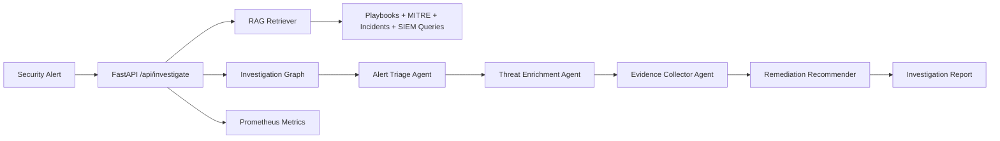

# AI Security Alert Investigation Agent

An incident response agent for SOC teams investigating suspicious security alerts. It combines RAG over security playbooks and past incidents with a multi-agent workflow for alert triage, threat enrichment, evidence collection, and remediation recommendations.

## What It Does

- Investigates identity and SIEM alerts through a FastAPI endpoint.
- Retrieves relevant playbooks, MITRE ATT&CK notes, past incidents, and hunting guidance.
- Runs deterministic agents that produce explainable risk scoring and evidence.
- Exposes Prometheus metrics and includes a Docker Compose stack with Postgres, pgvector, Prometheus, and Grafana.
- Ships with a realistic login anomaly sample: "Is this login anomaly a real account takeover?"

## Architecture



## Quick Start

Use Python 3.11 or newer.

```bash
python -m venv .venv
source .venv/bin/activate
pip install -r requirements.txt
uvicorn app.main:app --reload
```

Open:

- API docs: <http://localhost:8000/docs>
- Health: <http://localhost:8000/api/health>
- Sample alert: <http://localhost:8000/api/sample-alert>
- Metrics: <http://localhost:8000/api/metrics>

Run the included sample investigation:

```bash
python scripts/run_sample.py
```

Or call the API:

```bash
curl -s http://localhost:8000/api/sample-alert \
  | jq '{alert: .}' \
  | curl -s -X POST http://localhost:8000/api/investigate \
      -H 'Content-Type: application/json' \
      -d @-
```

## Docker Stack

```bash
docker compose up --build
```

Services:

- API: <http://localhost:8000>
- Prometheus: <http://localhost:9090>
- Grafana: <http://localhost:3000> with `admin` / `admin`
- Postgres with pgvector on `localhost:5432`

The local app uses an offline vector store by default so it runs without external APIs. `app/storage/postgres_pgvector.sql` provides the schema for a production pgvector-backed document store.

## Project Layout

```text
app/
  agents/                 Multi-agent investigation steps
  api/                    FastAPI routes
  core/                   Settings and telemetry
  data/                   Sample playbooks, incidents, alerts
  models/                 Pydantic schemas and graph state
  rag/                    Local retrieval implementation
  services/               Investigation graph orchestration
  storage/                pgvector schema
docker/                   Prometheus and Grafana provisioning
scripts/run_sample.py     CLI demo
```

## Next Extensions

- Replace `LocalVectorStore` with an embedding model and pgvector adapter.
- Add connectors for Okta, Microsoft Sentinel, CrowdStrike, and Splunk.
- Add analyst feedback to tune scoring thresholds.
- Persist investigation reports to Postgres.
- Swap the deterministic orchestration for LangGraph when deploying with LLM-backed reasoning.
