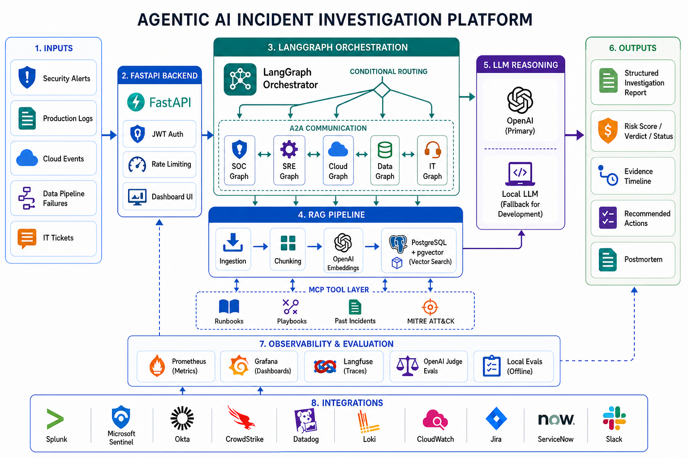

# 🚨 Agentic AI Incident Investigation Platform

A production-ready agentic incident investigation platform that helps security, SRE, cloud, data, and IT teams investigate alerts, logs, metrics, traces, runbooks, and historical incidents using LangGraph + Retrieval Augmented Generation (RAG), OpenAI-powered reasoning and embeddings, MCP support, and A2A task/result execution.

## 🌟 Why this project exists

During incidents, teams spend valuable time searching logs, dashboards, tickets, runbooks, security playbooks, and past incidents to understand what happened and what to do next.

This system acts as an AI copilot for incident investigation, helping reduce triage time and improve response consistency across operational domains.

The platform can:

- Analyze security alerts, production errors, cloud events, data pipeline failures, and IT incidents
- Retrieve relevant runbooks, security playbooks, MITRE ATT&CK notes, and past incidents
- Route incidents through domain-specific LangGraph workflows
- Discover and call MCP-style tools for evidence collection and dry-run actions
- Coordinate specialist SOC, SRE, cloud, data, and IT agents through structured A2A task/result exchange
- Upload logs and runbooks through the API for chunking, OpenAI embeddings, and retrieval
- Collect evidence from logs, metrics, events, and alert payloads
- Produce structured reports with risk/status, timeline, evidence, references, and recommended actions
- Generate postmortems after investigations
- Maintain conversation memory across analyst sessions

## 🏗️ Architecture Overview



High level workflow:

Incident alert, logs, metrics, or SIEM events  
-> LangGraph orchestration  
-> A2A-style capability routing selects the specialist domain agent
-> MCP tools collect integration-ready evidence
-> RAG pipeline retrieves relevant runbooks, playbooks, incidents, and ATT&CK notes  
-> Domain-specific investigation nodes reason over evidence and references  
-> Structured incident response report

Core stack:

- FastAPI for API backend
- LangGraph for multi-step investigation workflows
- MCP tool registry for evidence and action tools
- A2A specialist agent registry for task/result execution
- OpenAI models for LLM reasoning and embeddings
- Automatic local Ollama fallback when no OpenAI API key is configured
- Optional Anthropic-compatible LLM provider switching
- Bounded exponential retry with jitter for transient LLM provider failures
- PostgreSQL + pgvector for vector search
- Redis for session memory and caching
- JWT authentication for protected investigation endpoints
- Optional Langfuse tracing for LLM and investigation observability
- Pydantic models for structured investigation reports
- Prometheus + Grafana for monitoring
- Docker for local containerization
- AWS-ready deployment templates that cost nothing until applied
- Lightweight built-in dashboard at `/api/dashboard`

## 🌐 Supported Domains

| Domain | Example Question | Output Focus |
|---|---|---|
| 🔐 Security | "Is this login anomaly a real account takeover?" | Verdict, risk score, evidence, containment |
| 🛠️ Production / SRE | "Why is checkout returning 503 errors?" | Status, impact, likely causes, mitigation |
| ☁️ Cloud Infrastructure | "Why did capacity drop in this cluster?" | Cloud events, quotas, routing, failover |
| 🧬 Data Engineering | "Why did this pipeline fail or drift?" | Freshness, schema, quality, backfill steps |
| 🖥️ IT Operations | "Why are users unable to access VPN or email?" | User impact, access path, workaround, escalation |

## 🤖 Key Features

### 🧭 Multi-Domain LangGraph Workflows

- Security-specific workflow for alert triage, threat enrichment, evidence collection, and remediation
- Generic incident workflow for production, cloud, data, and IT incidents
- Conditional domain routing through SOC, SRE, cloud, data, and IT graph paths
- A2A specialist communication through agent manifests and FastAPI task/result endpoints
- Low-risk incidents can skip live LLM reasoning; high-risk incidents add escalation recommendations
- Domain-specific status or verdict generation
- RAG-grounded reasoning before response recommendations
- Conversation memory per analyst session using Redis with in-memory fallback
- Optional LangGraph Postgres checkpointing by session/thread id

### 🧠 Retrieval Augmented Generation Pipeline

This project uses a RAG-style pipeline to ground investigations in operational knowledge.

- Security playbooks and MITRE ATT&CK notes
- Production incident runbooks
- Cloud infrastructure runbooks
- Data pipeline runbooks
- IT operations runbooks
- Past incident archive examples
- OpenAI embedding generation using `text-embedding-3-small`
- Local Ollama or deterministic fallback embeddings when no OpenAI API key is configured
- PostgreSQL + pgvector retrieval runtime
- API ingestion for uploaded logs and runbooks
- Local in-memory searchable fallback for uploaded chunks when Postgres is disabled
- Knowledge-base ingestion script for indexing playbooks and runbooks

### ⚙️ Production Backend

- FastAPI REST API
- JWT token endpoint and protected investigation routes
- Role-based access control for `security_analyst`, `sre`, `data_engineer`, `it_ops`, and `admin`
- Report persistence with Postgres support and in-memory fallback
- Async Postgres connection pooling for report and ingestion writes
- Optional LangGraph checkpoint persistence using `AsyncPostgresSaver`
- Production-style integration registry for Splunk, Sentinel, Okta, CrowdStrike, Datadog, Loki, CloudWatch, Jira, ServiceNow, and Slack
- Integration catalog, readiness checks, required metadata validation, and local-safe evidence previews
- MCP tool manifest endpoint and structured tool-call endpoint
- A2A agent manifest endpoint, handoff endpoint, and multi-message exchange endpoint
- Postmortem generation from stored reports
- Typed request and response models
- Health and metrics endpoints
- Input validation with Pydantic
- Structured investigation reports
- Docker Compose setup for API, Postgres, Redis, Ollama, Prometheus, Grafana, and optional Langfuse

### 📊 Observability & Evaluation

- Prometheus metrics endpoint
- Investigation count and duration metrics
- Per-node execution duration metrics
- MCP tool availability, call count, status, and latency metrics
- A2A agent capability, task/result message count, handoff count, status, and latency metrics
- Domain routing, evidence item, and automated response step counters
- Grafana provisioning included
- Optional Langfuse tracing endpoint configuration
- Hybrid evaluation framework with local checks, optional OpenAI judge scoring, and optional Langfuse trace upload
- 12 cross-domain eval cases covering expected status/verdict, evidence, and actions

### ⚡ Performance & Reliability

- Docker Compose setup for local services
- Redis-backed session memory with in-memory fallback
- OpenAI provider calls use retry/backoff before falling back to local reasoning
- Makefile and uv workflow for repeatable local commands
- AWS-ready deployment templates under `infra/aws/`
- API dashboard for submitting incidents, ingesting runbooks, viewing reports, generating postmortems, and validating integrations

## 🔌 MCP + A2A Architecture

The project includes MCP support and A2A task/result execution for tool-connected, multi-agent incident investigation.

- MCP tools expose discoverable manifests and a single structured execution path
- MCP tools include runbook search, security log search, observability query, identity event inspection, ticket creation, and escalation workflows
- A2A agents expose capability manifests for SOC, SRE, cloud, data, and IT workflows
- LangGraph routes incidents to the correct primary specialist agent
- The primary specialist agent sends a task to a peer agent and receives a result back
- Each investigation records a three-message A2A exchange in the timeline
- Prometheus tracks tool calls, handoffs, routing, evidence collection, and automated response steps

Representative metrics this enables:

| Metric | What it shows |
|---|---|
| `incident_mcp_tool_calls_total` | MCP-style evidence/action tool usage by tool, mode, and status |
| `incident_mcp_tool_duration_seconds` | Tool execution latency |
| `incident_a2a_messages_total` | Structured A2A task/result messages by source, target, task type, and status |
| `incident_a2a_handoffs_total` | A2A handoff/message processing by source, target, domain, and status |
| `incident_a2a_handoff_duration_seconds` | A2A message processing latency |
| `incident_domain_routing_total` | Domain workflow routing coverage |
| `incident_evidence_items_total` | Evidence completeness by domain and evidence type |
| `incident_automated_steps_total` | Number of incident-response steps automated |

## 💡 Example Use Cases

Example investigations:

- "Is this impossible-travel login a real account takeover?"
- "Checkout is returning 503 errors after a deploy. What should we check first?"
- "A cloud autoscaling event coincided with elevated latency. What changed?"
- "A data pipeline failed quality checks. Should downstream consumers be paused?"
- "Users cannot access VPN. What evidence should IT collect?"

The platform retrieves relevant runbook sections and produces structured investigation guidance with evidence, risk or status, references, and recommended actions.

## 📂 Project Structure

```text
app/
 ├── api/                # FastAPI REST endpoints
 ├── agents/             # Security investigation agents
 ├── core/               # App settings, security, and telemetry
 ├── data/
 │    ├── knowledge_base/ # Security, production, cloud, data, and IT runbooks
 │    └── sample_alerts/  # Demo security and production incidents
 ├── models/             # Pydantic schemas and LangGraph state models
 ├── rag/                # Retrieval pipeline and uploaded in-memory document store
 ├── services/           # Workflows, MCP tools, A2A exchange, ingestion, persistence, integrations
 └── storage/            # PostgreSQL + pgvector schema and runtime adapter

scripts/                 # CLI demo and ingestion scripts
evals/                   # Evaluation cases and JSON reports
docker/                  # Prometheus and Grafana configuration
infra/aws/               # AWS-ready templates and deployment notes
```

## 🚀 Getting Started

### ✅ Prerequisites

- Python 3.11+
- uv
- Docker + Docker Compose
- OpenAI API key for primary LLM reasoning and embeddings
- Ollama is optional for local fallback when no OpenAI API key is configured
- PostgreSQL with pgvector for vector search
- Redis for session memory

### 🔧 Local Setup

Clone the repo:

```bash
git clone https://github.com/swathiblrs/AI-Security-Alert-Investigation-Agent.git
cd AI-Security-Alert-Investigation-Agent
```

Install dependencies:

```bash
uv sync
```

Create environment file:

```bash
cp .env.example .env
```

For OpenAI-powered reasoning and embeddings, set:

```env
LLM_PROVIDER=openai
OPENAI_API_KEY=your_key
OPENAI_MODEL=gpt-4o-mini
OPENAI_EMBED_MODEL=text-embedding-3-small
```

If `OPENAI_API_KEY` is blank, the platform automatically uses local Ollama and deterministic fallback behavior for development.

Run locally:

```bash
make dev
```

Swagger docs available at:

```text
http://localhost:8000/docs
```

Useful endpoints:

```text
POST /api/auth/token
GET  /api/health
GET  /api/sample-alert
POST /api/investigate
POST /api/incidents/investigate
POST /api/ingest/document
POST /api/ingest/logs
GET  /api/reports
POST /api/reports/{investigation_id}/postmortem
POST /api/integrations
GET  /api/integrations/catalog
GET  /api/integrations/{integration_id}/health
GET  /api/mcp/tools
POST /api/mcp/tools/call
GET  /api/a2a/agents
POST /api/a2a/handoff
POST /api/a2a/exchange
GET  /api/platform/metrics-snapshot
GET  /api/sessions/{session_id}/memory
DELETE /api/sessions/{session_id}
GET  /api/metrics
GET  /api/dashboard
```

Run sample investigations:

```bash
make sample
```

Index the local knowledge base into pgvector:

```bash
make ingest
```

## 🐳 Run with Docker

```bash
docker compose up --build
```

Monitoring dashboards:

```text
Prometheus -> http://localhost:9090
Grafana    -> http://localhost:3000
API        -> http://localhost:8000
Ollama     -> http://localhost:11434  # local fallback provider
Redis      -> localhost:6379
```

Grafana default login:

```text
admin / admin
```

## 🧪 Testing

Run automated tests:

```bash
make test
```

The test suite validates:

- Security alert investigation workflow
- Generic production incident workflow
- FastAPI investigation endpoints
- Document ingestion and local retrieval support
- Report persistence and postmortem generation
- Integration registry behavior
- MCP-style tool manifests and local tool execution
- A2A-style agent manifests and specialist task/result exchange
- Platform metrics snapshot for resume-ready measurable capability counts
- Role-based access control
- Risk/status generation
- Presence of references and remediation actions
- JWT authentication and session memory
- LangGraph workflow compilation
- Session cleanup for Redis memory and LangGraph checkpoints

Run evaluation cases:

```bash
make eval
```

By default, evaluation runs locally with no API cost. If `OPENAI_API_KEY` is configured, the same runner adds OpenAI judge scoring. If Langfuse credentials are also configured, it uploads evaluation traces.

```env
OPENAI_API_KEY=your_key
EVALUATION_PROVIDER=auto
EVALUATION_MODEL=gpt-4o-mini
LANGFUSE_ENABLED=true
LANGFUSE_HOST=https://cloud.langfuse.com
LANGFUSE_PUBLIC_KEY=your_public_key
LANGFUSE_SECRET_KEY=your_secret_key
```

Reports are generated in:

```text
evals/reports/
```

Report fields include:

- `evaluation_mode`
- `passed`
- `openai_judged`
- `langfuse_traces_sent`
- per-case local pass/fail and optional OpenAI judge rationale

Run platform verification:

```bash
make verify
```

This creates:

```text
evals/reports/platform_verification.json
```

The verification report checks that:

- 6 MCP-style tools are discoverable
- 5 A2A-style domain agents are discoverable
- 15+ agent capabilities are advertised
- Security and production sample investigations include MCP timeline markers
- Security and production sample investigations include A2A exchange markers
- Security and production sample investigations include peer-to-peer A2A messages
- MCP/A2A evidence is attached to generated reports
- Recommended actions are generated

## ☁️ AWS Deployment Setup

AWS-ready templates live in:

```text
infra/aws/
```

These files are free to keep in the repo. They only cost money if you intentionally create AWS resources, for example by running Terraform apply or deploying ECS/RDS/ElastiCache resources.

## 🔮 Future Improvements

- Replace integration stubs with live vendor adapters and OAuth/secret management
- Add larger multi-domain evaluation datasets from real incident templates
- Add analyst feedback loops for domain-specific scoring calibration
- Add richer frontend filtering, charts, and collaborative incident rooms
- Add full Terraform ECS/RDS/ElastiCache modules when ready to deploy

## 🙌 Acknowledgements

Built as a multi-domain incident investigation project using FastAPI, LangGraph, OpenAI-powered RAG, pgvector-ready storage, Redis session memory, local Ollama fallback, and monitoring patterns for security and operations workflows.
